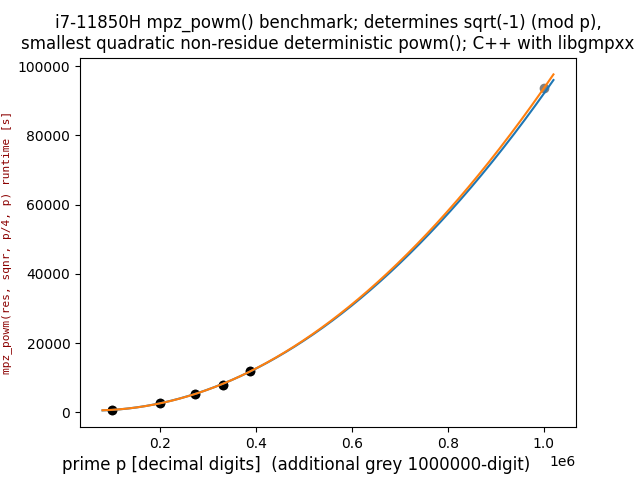

# QuadraticRegression
Quadratic Regression algorithm with least square method, with matplotlib graphing implementation.

Takes in a set of points from a csv file, and predicts the quadratic funciton that best follows the points.


Usage:
```
python main.py file.csv
```


## Self contained example  
(with pandas ```pd.DataFrame({"x": [...], "y": [...]})``` instead of ```pd.read_csv(sys.argv[1])```):  
```
python sympy_gaussian_integer_gcd_benchmark.py
```


**IMPORTANT**  
Python ```gcd(p, sqrtm1 + I)``` was computed to determine sum of squares ```p = x**2 + y**2```.  
Pari/GP ```halfgcd(sqrtm1, p)``` computes sum of squares in only 123ms(!) for 388342-digit prime!

## Self contained example with multiple curves  

### different curves
Put data for 2nd curve into ```py.csv``` and run ```python main.py py.csv```. Copy the printed quadratic function into self contained Python script as ```y2``` adjusting to Python syntax. Add "y2" and data points to ```pd.DataFrame({"x": [...], "y": [...], "y2": [...]})```. Then:  
```
python sqrtm1_.py
```
  

Runtimes in ```sqrtm1_.py``` were determined with this C++ libgmpxx code:  
[https://github.com/Hermann-SW/RSA_numbers_factored/blob/main/c%2B%2B/sqrtm1.cc](https://github.com/Hermann-SW/RSA_numbers_factored/blob/main/c%2B%2B/sqrtm1.cc)

### same curves, vizualize effect of additional value[s]
Example to visualize effect of one additional data point:  
```
python sqrtm1__.py
```
As can be seen, there is nearly no difference in quadratic regression curves, with and without new grey 1000000-digit prime data point:  
  

New datapoint was smallest 1000000-digit kown prime, rank 2137 of this list:  
https://t5k.org/primes/lists/all.txt

Biggest known prime has 24,862,048 decimal digits, but it is =3 (mod 4).  

Biggest known prime =1 (mod 4) has rank 9 with 9,383,761-digits.  
Extrapolating runtime for that prime with curve corrected for 1000000-digit prime says, that more than 106 days with i7-11850H CPU at boost frequency of up to 4.8GHz (only 1 process running) are needed to compute sqrtm1 for that prime.

