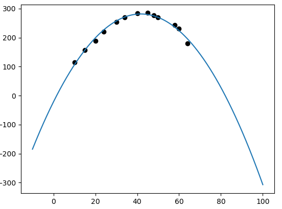
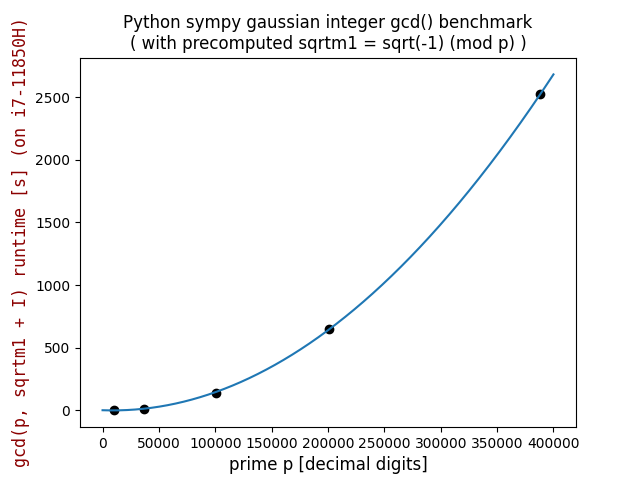
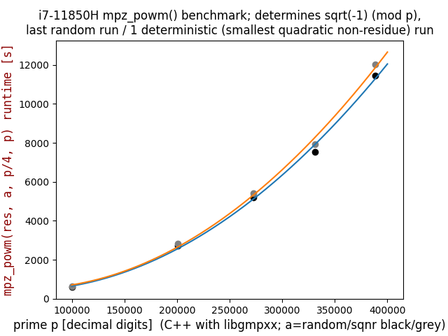

# QuadraticRegression
Quadratic Regression algorithm with least square method, with matplotlib graphing implementation.

Takes in a set of points from a csv file, and predicts the quadratic funciton that best follows the points.



Usage:
```
python main.py file.csv
```


## Self contained example  
(with pandas ```pd.DataFrame({"x": [...], "y": [...]})``` instead of ```pd.read_csv(sys.argv[1])```):  
```
python sympy_gaussian_integer_gcd_benchmark.py
```


**IMPORTANT**  
Python ```gcd(p, sqrtm1 + I)``` was computed to determine sum of squares ```p = x**2 + y**2```.  
Pari/GP ```halfgcd(sqrtm1, p)``` computes sum of squares in only 123ms(!) for 388342-digit prime!

## Self contained example with multiple curves  
Put data for 2nd curve into ```py.csv``` and run ```python main.py py.csv```. Copy the printed quadratic function into self contained Python script as ```y2``` adjusting to Python syntax. Add "y2" and data points to ```pd.DataFrame({"x": [...], "y": [...], "y2": [...]})```. Then:  
```
python sqrtm1_.py
```

