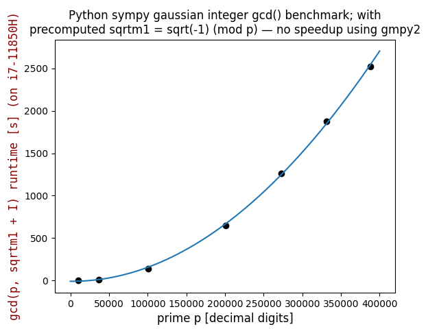

# QuadraticRegression
Quadratic Regression algorithm with least square method, with matplotlib graphing implementation.

Takes in a set of points from a csv file, and predicts the quadratic funciton that best follows the points.


Usage:
```
python main.py file.csv
```


Self contained example (with pandas ```pd.DataFrame({"x": [...], "y": [...]})``` instead of ```pd.read_csv(sys.argv[1])```):  
```
python sympy_gaussian_integer_gcd_benchmark.py
```

